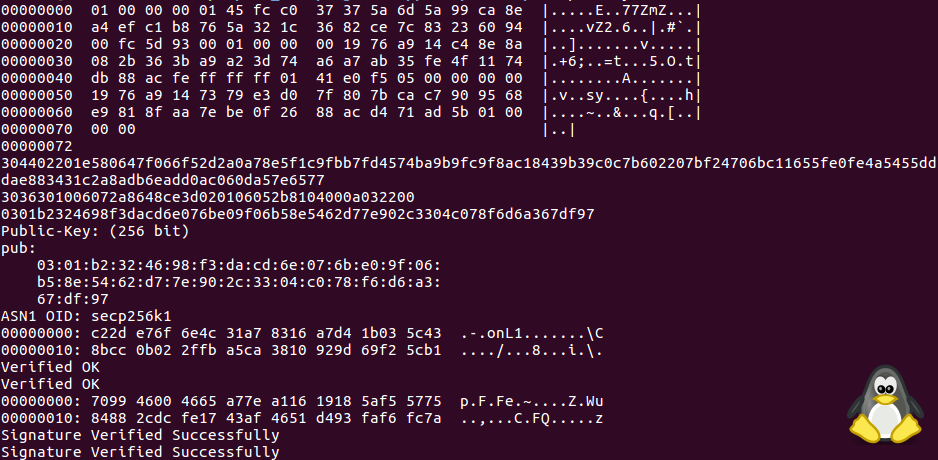
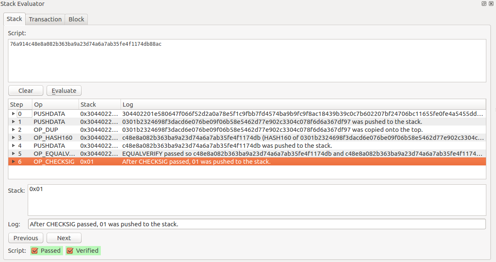

### Veryfing TX in Komodo with OpenSSL

Ok, let's look how we can verify tx signatures using OpenSSL in Komodo. For example, we have following tx:

	5dd20c8c72907356be3e5ed4135b15c8ff10060e9b65e269f46538d29773e45e

In explorer:  https://kmdexplorer.io/tx/5dd20c8c72907356be3e5ed4135b15c8ff10060e9b65e269f46538d29773e45e

Raw TX:

	010000000145fcc037375a6d5a99ca8ea4efc1b8765a321c3682ce7c8323609400fc5d9300010000006a47304402201e580647f066f52d2a0a78e5f1c9fbb7fd4574ba9b9fc9f8ac18439b39c0c7b602207bf24706bc11655fe0fe4a5455dddae883431c2a8adb6eadd0ac060da57e657701210301b2324698f3dacd6e076be09f06b58e5462d77e902c3304c078f6d6a367df97feffffff0141e0f505000000001976a9147379e3d07f807bcac7909568e9818faa7ebe0f2688acd471ad5b
	

Decode:

	{
	  "txid": "5dd20c8c72907356be3e5ed4135b15c8ff10060e9b65e269f46538d29773e45e",
	  "overwintered": false,
	  "version": 1,
	  "locktime": 1538093524,
	  "vin": [
	    {
	      "txid": "00935dfc00946023837cce82361c325a76b8c1efa48eca995a6d5a3737c0fc45",
	      "vout": 1,
	      "scriptSig": {
	        "asm": "304402201e580647f066f52d2a0a78e5f1c9fbb7fd4574ba9b9fc9f8ac18439b39c0c7b602207bf24706bc11655fe0fe4a5455dddae883431c2a8adb6eadd0ac060da57e657701 0301b2324698f3dacd6e076be09f06b58e5462d77e902c3304c078f6d6a367df97",
	        "hex": "47304402201e580647f066f52d2a0a78e5f1c9fbb7fd4574ba9b9fc9f8ac18439b39c0c7b602207bf24706bc11655fe0fe4a5455dddae883431c2a8adb6eadd0ac060da57e657701210301b2324698f3dacd6e076be09f06b58e5462d77e902c3304c078f6d6a367df97"
	      },
	      "sequence": 4294967294
	    }
	  ],
	  "vout": [
	    {
	      "value": 0.99999809,
	      "interest": 0.00000000,
	      "valueZat": 99999809,
	      "n": 0,
	      "scriptPubKey": {
	        "asm": "OP_DUP OP_HASH160 7379e3d07f807bcac7909568e9818faa7ebe0f26 OP_EQUALVERIFY OP_CHECKSIG",
	        "hex": "76a9147379e3d07f807bcac7909568e9818faa7ebe0f2688ac",
	        "reqSigs": 1,
	        "type": "pubkeyhash",
	        "addresses": [
	          "RKomodoPpLgMFHBsq8mZLcJvq4GfPhMobQ"
	        ]
	      }
	    }
	  ],
	  "vjoinsplit": [
	  ]
	}
	
Look at the input=0 script (vin[0] scriptSig hex field from decode above):

	47304402201e580647f066f52d2a0a78e5f1c9fbb7fd4574ba9b9fc9f8ac18439b39c0c7b602207bf24706bc11655fe0fe4a5455dddae883431c2a8adb6eadd0ac060da57e657701210301b2324698f3dacd6e076be09f06b58e5462d77e902c3304c078f6d6a367df97	

Decode it:

	47 // push next 0x47 bytes
	304402201e580647f066f52d2a0a78e5f1c9fbb7fd4574ba9b9fc9f8ac18439b39c0c7b602207bf24706bc11655fe0fe4a5455dddae883431c2a8adb6eadd0ac060da57e6577 // signature
	01 // hashtype=01 (SIGHASH_ALL)
	21 // push next 0x21 bytes
	0301b2324698f3dacd6e076be09f06b58e5462d77e902c3304c078f6d6a367df97 // compressed pubkey for address RTCVGuoSNehKG8YYxcoskC7LK1yZhgvQRV
	
	
	

How do we check - is this transaction valid? Is it correctly signed?

1) Remove input script from transaction. We should remove bytes (do not forget about script len)

	010000000145fcc037375a6d5a99ca8ea4efc1b8765a321c3682ce7c8323609400fc5d930001000000<len><scriptSig>feffffff0141e0f505000000001976a9147379e3d07f807bcac7909568e9818faa7ebe0f2688acd471ad5b

2) Replace it with the funding script to RTCVGuoSNehKG8YYxcoskC7LK1yZhgvQRV , funding script is related to txid [00935dfc00946023837cce82361c325a76b8c1efa48eca995a6d5a3737c0fc45](https://kmdexplorer.io/tx/00935dfc00946023837cce82361c325a76b8c1efa48eca995a6d5a3737c0fc45)  and [vout 1](https://kmdexplorer.io/tx/00935dfc00946023837cce82361c325a76b8c1efa48eca995a6d5a3737c0fc45/%3E/1)  :

	OP_DUP OP_HASH160 c48e8a082b363ba9a23d74a6a7ab35fe4f1174db OP_EQUALVERIFY OP_CHECKSIG

	1976a914c48e8a082b363ba9a23d74a6a7ab35fe4f1174db88ac
	
(Do not forget about script length again! 0x19 here - is a script length)

You should get:

	010000000145fcc037375a6d5a99ca8ea4efc1b8765a321c3682ce7c8323609400fc5d9300010000001976a914c48e8a082b363ba9a23d74a6a7ab35fe4f1174db88acfeffffff0141e0f505000000001976a9147379e3d07f807bcac7909568e9818faa7ebe0f2688acd471ad5b

3) Append SIGHASH_ALL as 32-bit low-endian value. The result will be:

	010000000145fcc037375a6d5a99ca8ea4efc1b8765a321c3682ce7c8323609400fc5d9300010000001976a914c48e8a082b363ba9a23d74a6a7ab35fe4f1174db88acfeffffff0141e0f505000000001976a9147379e3d07f807bcac7909568e9818faa7ebe0f2688acd471ad5b01000000

4) Now let's fill our data:

- komodo.inphex (our unsigned tx + SIGHASH_ALL):

	010000000145fcc037375a6d5a99ca8ea4efc1b8765a321c3682ce7c8323609400fc5d930001000000
	1976a914c48e8a082b363ba9a23d74a6a7ab35fe4f1174db88ac
	feffffff0141e0f505000000001976a9147379e3d07f807bcac7909568e9818faa7ebe0f2688acd471ad5b
	01000000

- komodo.sighex:

	304402201e580647f066f52d2a0a78e5f1c9fbb7fd4574ba9b9fc9f8ac18439b39c0c7b602207bf24706bc11655fe0fe4a5455dddae883431c2a8adb6eadd0ac060da57e6577

- komodo.keyhex :

	3036301006072a8648ce3d020106052b8104000a032200
	0301b2324698f3dacd6e076be09f06b58e5462d77e902c3304c078f6d6a367df97
	
	As you understand 0301b2324698f3dacd6e076be09f06b58e5462d77e902c3304c078f6d6a367df97 here - is a pubkey, and 3036301006072a8648ce3d020106052b8104000a032200 is a "special DER string" for compressed pubkey, needed to convert DER to PEM.
	
You can check PEM generation from komodo.keyhex by this:

	xxd -r -p <komodo.keyhex | openssl pkey -pubin -inform der -text 
	
Output should be:

	-----BEGIN PUBLIC KEY-----                                       
	MDYwEAYHKoZIzj0CAQYFK4EEAAoDIgADAbIyRpjz2s1uB2vgnwa1jlRi136QLDME 
	wHj21qNn35c=                                                     
	-----END PUBLIC KEY-----                                         
	Public-Key: (256 bit)                                            
	pub:                                                             
	    03:01:b2:32:46:98:f3:da:cd:6e:07:6b:e0:9f:06:                
	    b5:8e:54:62:d7:7e:90:2c:33:04:c0:78:f6:d6:a3:                
	    67:df:97                                                     
	ASN1 OID: secp256k1                                              
	
Now we are ready to launch `verify.sh` and validate signature:

 

Little bit more hard case in tx with 2 vins, if somebody interesting i will show how to validate tx with 2 or more vins later.

**p.s.** Example of verifying of this tx using [Hashmal](https://github.com/DeckerSU/hashmal) and Stack Evaluator:

Or if you don't interesting how bitcoin scripts worked, you can simply use Transaction Analyser in  [Hashmal](https://github.com/DeckerSU/hashmal) .

### Useful links

- https://bitcoin.stackexchange.com/questions/32305/how-does-the-ecdsa-verification-algorithm-work-during-transaction/32308#32308
- https://bitcoin.stackexchange.com/questions/46455/verifying-a-bitcoin-trx-on-the-unix-cmd-line-with-openssl
- https://medium.com/coinmonks/how-to-generate-a-bitcoin-address-step-by-step-9d7fcbf1ad0b
- https://www.openssl.org/docs/man1.0.2/apps/ec.html
- https://klmoney.wordpress.com/bitcoin-dissecting-transactions-part-1/
- https://klmoney.wordpress.com/bitcoin-dissecting-transactions-part-2-building-a-transaction-by-hand/
- https://github.com/DeckerSU/hashmal

